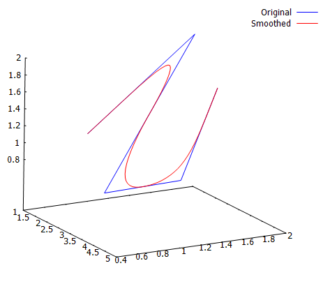
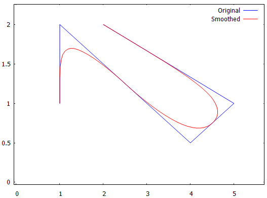

# Rust Fast Curve 3d

[](https://opensource.org/licenses/Apache-2.0)

This algorithm is generates a curve from a list of control points.

## References: 
Original paper: G. M. Chaikin, “An algorithm for high-speed curve generation, Computer Graphics and Image Processing,” vol. 3, 1974, pp. 346-349
[On Chaikin's algorithm R.F.Riesenfeld](https://www.sciencedirect.com/science/article/abs/pii/0146664X75900179)

The library contains the following functions:
- fast_curve_2d for generating curves in 2D.
- fast_curve_3d for generating curves in 3D.

## Examples:
For the examples the [rust gnuplot](https://crates.io/crates/gnuplot) library is used.

### 3d curve generation
```rust
    let x = vec![1.0,1.0,4.0,5.0,2.0];
    let y = vec![1.0,2.0,0.5,1.0,2.0];
    let z = vec![1.0,2.0,0.8,1.0,1.5];
    let n: u8 = 4;

    let (xn,yn,zn) = fast_curve_3d(&x, &y, &z, n);

    // gnu plot Figure
    let mut fg = Figure::new();
    fg.axes3d()
    .lines(&x, &y, &z,&[Caption("Original"), Color("blue")])
    .lines(&xn, &yn, &zn, &[Caption("Smoothed"), Color("red")]);
    fg.set_scale(1.0, 1.0);
    fg.show().unwrap();
```


### 2d curve generation
```rust
    let x = vec![1.0,1.0,4.0,5.0,2.0];
    let y = vec![1.0,2.0,0.5,1.0,2.0];
    let n: u8 = 4;

     let (xn,yn) = fast_curve_2d(&x, &y, n);


    let mut fg = Figure::new();
    fg.axes2d()
    .lines(&x, &y,&[Caption("Original"), Color("blue")])
    .lines(&xn, &yn, &[Caption("Smoothed"), Color("red")]);
    
    fg.set_scale(1.0, 1.0);
    fg.show().unwrap();
```

